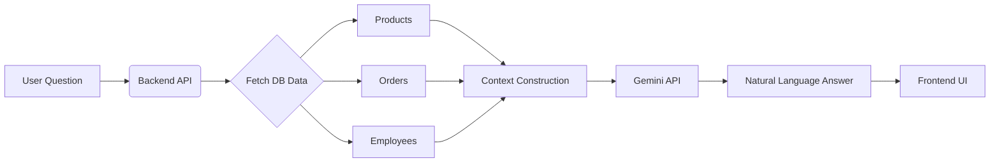
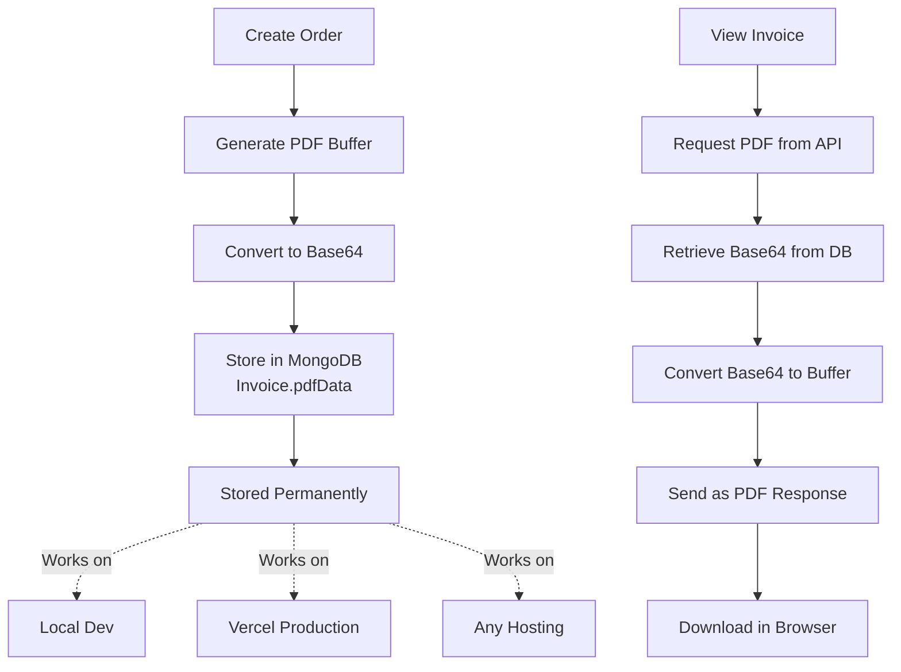

# TRIACT - AI-Powered Retail Intelligence System


<div align="center">


</div>

---

## 📖 Overview

**TRIACT** is a modern, full-stack inventory and business management platform designed to digitize small retail operations. Unlike static POS systems, TRIACT integrates **Generative AI** and **Computer Vision** to act as an intelligent business partner.

It empowers shop owners to:

- **Chat with their Data:** Ask natural language questions about sales, profit, and employee performance.
- **Predict the Future:** Forecast stockouts days in advance using historical sales velocity.
- **Automate Entry:** Digitize paper invoices instantly using OCR technology.

---

## � Project Status

### ✅ Recent Updates (May 2026)

- **PDF Storage Architecture Upgraded**: Migrated from Vercel Blob storage to MongoDB base64 encoding
  - 📦 PDFs now stored directly in database as base64 strings
  - 🌍 Works identically on local development and Vercel production
  - 🔒 Authenticated downloads via JWT verification
  - 🚀 Zero external dependencies for PDF storage

- **Invoice Download Feature**: Implemented secure authenticated PDF downloads
  - Frontend button triggers programmatic download with auth token
  - Backend converts base64 to buffer and streams PDF
  - Full support for local and production environments

### 🎯 Current Implementation Status

| Feature                    | Status | Notes                                  |
| -------------------------- | ------ | -------------------------------------- |
| User Authentication        | ✅     | JWT-based with role-based access       |
| Dashboard & KPIs           | ✅     | Real-time analytics for owners         |
| POS & Billing              | ✅     | Order creation with stock management   |
| PDF Invoice Generation     | ✅     | PDFKit with base64 MongoDB storage     |
| Invoice Viewing & Download | ✅     | Authenticated secure downloads         |
| Low Stock Alerts           | ✅     | Automatic notifications                |
| Employee Management        | ✅     | Salary tracking and assignment         |
| RAG Chat Assistant         | ✅     | Google Gemini integration              |
| Stock Forecasting          | ✅     | 90-day historical analysis             |
| OCR Invoice Scanner        | ✅     | Tesseract.js for document digitization |

---

### 🧠 Artificial Intelligence Suite

- **RAG Chat Assistant:** Built on **Google Gemini 2.5 Flash**. It uses a **Retrieval-Augmented Generation (RAG)** architecture to fetch real-time database stats (revenue, stock, margins) and provide context-aware business answers in plain English.
- **Stock Forecasting:** A dedicated algorithm analyzes the last 90 days of `Order` data to calculate average daily sales and predict the exact date a product will go out of stock.
- **Smart OCR Scanner:** Powered by **Tesseract.js**. Upload an image of a supplier invoice, and the system automatically extracts item names and quantities to update inventory without manual typing.

### 📊 Comprehensive Dashboard

- **Owner View:** Real-time KPI cards for Revenue, Net Profit, and Units Sold. Includes visual charts for monthly revenue trends and category-wise sales distribution.
- **Low Stock Alerts:** Automated system notifications trigger when product stock dips below defined thresholds.

### ⚡ Point of Sale (POS) & Operations

- **Smart Billing:** Fast, searchable product grid for rapid checkout.
- **PDF Invoicing:** Automatically generates professional PDF invoices using `PDFKit`.
  - **Storage:** PDFs stored as base64 in MongoDB for **persistent storage across all environments** (local, staging, production).
  - **Download:** Secure authenticated download with JWT verification.
- **Employee Management:** Track staff profiles, monthly salaries, and payment status (Paid/Due/Overdue).

---

## 🏗️ Architecture & Tech Stack

The application follows a **Decoupled Monolith** architecture where the frontend and backend are separate but designed to work seamlessly together.

### Frontend (Client)

- **Framework:** React 18 (Vite Build Tool)
- **Styling:** Tailwind CSS (Utility-first) + Framer Motion (Animations)
- **State Management:** React Context API + Custom Hooks (`useAuth`)
- **HTTP Client:** Axios with Interceptors for JWT handling
- **Visuals:** Chart.js for analytics, Lucide React for iconography

### Backend (Server)

- **Runtime:** Node.js
- **Framework:** Next.js (Pages Router used as API Server)
- **Database:** MongoDB Atlas (Mongoose ODM)
- **Authentication:** JSON Web Tokens (JWT) with custom middleware (`authMiddleware`, `ownerMiddleware`)
- **AI Engine:** Google Generative AI SDK (`@google/generative-ai`)

---

### Data Flow Diagram (RAG Chat)



### PDF Storage Architecture



**Key Benefits:**

- ✅ Works on Vercel (no filesystem persistence needed)
- ✅ Works locally (same code path)
- ✅ Permanent storage (survives function restarts)
- ✅ Secure (JWT authentication required)
- ✅ Simple (no external services)

---

## ⚙️ Installation & Setup

### 1. Prerequisites

- Node.js (v18 or higher)
- MongoDB Atlas Account (Free tier works)
- Google AI Studio Account (for Gemini API Key)

### 2. Clone the Repository

```bash
git clone https://github.com/your-username/TRIACT.git
cd TRIACT
```

### 3. Backend Setup

```bash
cd backend
npm install
```

Create a `.env` file in `backend/`:

```ini
MONGODB_URI="mongodb+srv://<username>:<password>@cluster.mongodb.net/triact?retryWrites=true&w=majority"
JWT_SECRET="your_super_secret_jwt_key_here"
GEMINI_API_KEY="AIzaSy...<your_gemini_api_key>"
PORT=3001
FRONTEND_URL="http://localhost:5173"
```

Seed the Database:

```bash
npm run seed
```

Start Backend:

```bash
npm run dev
```

### 4. Frontend Setup

```bash
cd ../frontend
npm install
npm run dev
```

---

## 🧪 Test Credentials

| Role     | Email              | Password    | Access Level                            |
| -------- | ------------------ | ----------- | --------------------------------------- |
| Owner    | owner1@example.com | Password123 | Full Admin Access, Financials, Settings |
| Employee | rahul@example.com  | Password123 | POS, Salary View, Inventory View        |
| Employee | priya@example.com  | Password123 | POS, Salary View, Inventory View        |
| Employee | amit@example.com   | Password123 | POS, Salary View, Inventory View        |

### Testing the PDF Invoice Feature

1. **Login** with `owner1@example.com / Password123`
2. **Navigate** to View Invoices page
3. **Click "View PDF"** button on any invoice
4. **PDF will download** to your computer (no new tab opens)
5. **Open the downloaded PDF** to verify it displays correctly

**Try on different environments:**

- ✅ Local development: `http://localhost:5173`
- ✅ Production: Deploy to Vercel and test same flow

---

## 🔌 API Reference

| Method | Endpoint                               | Description                   | Access |
| ------ | -------------------------------------- | ----------------------------- | ------ |
| POST   | /api/auth/login                        | Authenticate user & get JWT   | Public |
| GET    | /api/shops/:shopId/dashboard           | Fetch KPI stats               | Owner  |
| POST   | /api/shops/:shopId/ai/chat             | Gemini RAG Chat               | Auth   |
| POST   | /api/shops/:shopId/orders              | Create order & generate PDF   | Auth   |
| GET    | /api/shops/:shopId/invoices            | List all invoices             | Auth   |
| GET    | /api/shops/:shopId/invoices/:invoiceId | Download PDF (Base64 from DB) | Auth   |
| POST   | /api/scan                              | OCR Scan                      | Auth   |
| GET    | /api/shops/:shopId/ai/forecast         | Stock prediction              | Owner  |

---

## 🐛 Troubleshooting

### General Issues

- Ensure backend runs on port 3001
- FRONTEND_URL must match Vite URL
- MongoDB Atlas IP must be whitelisted
- GEMINI_API_KEY must have quota

### PDF Invoice Issues

- **"Invoice PDF data not found"**: Make sure orders are created after seed data is loaded
- **Large database size**: Base64 encoding increases PDF size by ~33%. This is normal for small-to-medium invoice volumes
- **Download fails**: Check browser console for CORS or authentication errors. Ensure JWT token is valid

---

## 🤝 Contributing

- Fork the project
- Create feature branch
- Commit changes
- Push and open PR
